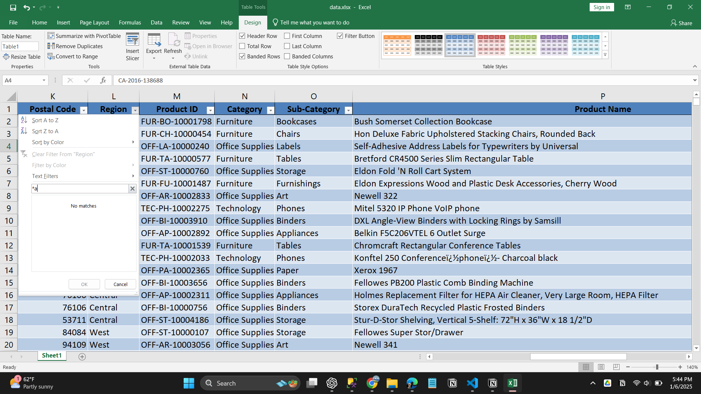

# Excel - Interview Questions

### 1. What is a cell address in Excel?

A cell address is used to identify a particular cell on a worksheet. It is denoted by a combination of the respective column letter and a row number.

As shown above, the highlighted cell belongs to the column ‘D’ and row 5, so the cell address is read as D5.

### 2. What do you mean by Relative cell referencing and Absolute cell referencing in MS Excel?

| Relative Cell Referencing                                                                                                                       | Absolute Cell Referencing                                                                                                                                                         |
| ----------------------------------------------------------------------------------------------------------------------------------------------- | --------------------------------------------------------------------------------------------------------------------------------------------------------------------------------- |
| In Relative referencing, there is a change when copying a formula from one cell to another cell with respect to the destination cell’s address. | Meanwhile, there is no change in Absolute cell referencing when a formula is copied, irrespective of the cell’s destination.                                                      |
| This type of referencing is there by default. Relative cell referencing doesn’t require a dollar sign in the formula.                           | If you don’t want a change in the formula when it’s copied across cells, then absolute referencing requires you to add a dollar sign before and after the column and row address. |
|                                                                                       |                                                                                                                         |

### 3. How do you freeze panes in Excel?
Freeze panes keep the rows and columns visible while scrolling through a worksheet. To freeze panes, select the View tab and go to Freeze Panes.

If you are looking to freeze the first two columns of a dataset, select the 3rd column, and click ‘Freeze Panes’. A thick grey border indicates this.

### 4. How can you restrict someone from copying a cell from your worksheet?
1. First, choose the data you want to protect.
2. Hit `Ctrl + Shift + F`. The Format Cells tab appears. Go to the Protection tab. Check Locked and click OK.
3. Next, go to the Review tab and select Protect Sheet. Enter the password to protect the sheet.

### 5. How is a Formula different from a Function in Excel?
### 6. Mention the order of operations used in Excel while evaluating formulas.
The order of operations in Excel is referred to as **PEDMAS**. Shown below is the order of precedence while performing an Excel operation. 

- Parentheses
- Exponentiation
- Division/Multiplication 
- Addition
- Subtraction

As seen above, first, the data in the parentheses is operated, followed by the exponentiation operation. After that, it can be either the division or multiplication operations. The result is then added and finally subtracted to give the final result.

### 7. How will you write the formula for the following? - Multiply the value in cell A1 by 10, add the result by 5, and divide it by 2.
To write a formula for the above-stated question, we have to follow the PEDMAS Precedence. The correct answer is ((A1*10)+5)/2.

Answers such as =A1*10+5/2 and =(A1*10)+5/2 are not correct. We must put parentheses brackets after a particular operation. 

The output will look like this

### 8. What is the difference between count, counta, and countblank?

The count function is very often used in Excel. Here, let’s look at the difference between count, and it’s variants - counta and countblank. 

#### 1. COUNT
It counts the number of cells that contain numeric values only. Cells that have string values, special characters, and blank cells will not be counted. Shown below is an example of the count function.

#### 2. COUNTA
It counts the number of cells that contain any form of content. Cells that have string values, special characters, and numeric values will be counted. However, a blank cell will not be counted. Shown below is an example of the counta function.

#### 3. COUNTBLANK
As the name suggests, it counts the number of blank cells only. Cells that have content will not be taken into consideration. Shown below is an example of the countblank function.

### 9. What is the shortcut to add a filter to a table?
The filter mechanism is used when you want to display only specific data from the entire dataset. By doing so, there is no change being made to the data. The shortcut to add a filter to a table is `Ctrl + Shift + L`.

### 10. How do you create a hyperlink in Excel?
Hyperlinks are used to navigate between worksheets and files/websites. To create a hyperlink, the shortcut used is `Ctrl + K`.

The ‘Insert Hyperlink’ box appears. Enter the address and the text to display. Here, we are directed to the Amazon Website.

### 11. How can we merge multiple cells text strings in a cell?

To merge text strings present in multiple cells into one cell, you can use the `CONCATENATE()`. Shown below is an example of the concatenate function. 

Another way of combining cell values is by using the “&” operator, as shown below:

### 12. How can you split a column into 2 or more columns?
You can split a column into 2 or more columns by following the below steps:

1. Select the cell that you want to split. Then, navigate to the Data tab, after that, select Text to Columns.

2. Select the delimiter.

3. Choose the column data format and select the destination you want to display the split.

4. The final output will look like below where the text is split into multiple columns.

### 13. What is the use of VLOOKUP and how do we use it?

| **Function** | **VLOOKUP** |
|--------------|-------------|
| **Description** | The VLOOKUP function in Excel is used to look up information in a table and extract the corresponding data. |
| **Syntax** | `VLOOKUP(value, table, col_index, [range_lookup])` |
| **Arguments** | |
| `value` | Indicates the data you are looking for in the first column of the table. |
| `table` | Refers to the set of data (table) from which you need to retrieve the value. |
| `col_index` | Refers to the column in the table from where you need to retrieve the value. |
| `range_lookup` | FALSE = exact match (optional), TRUE = approximate match (default). |
| **Example** | Find the product related to the customer name "Richard." |

### 14. How is VLOOKUP different from the LOOKUP function?
| **Function**    | **Description**                                                                                                                                                       | **Usage**                                               |
|-----------------|-----------------------------------------------------------------------------------------------------------------------------------------------------------------------|---------------------------------------------------------|
| **VLOOKUP**     | VLOOKUP allows the user to search for a value in the left-most column of a table and then return a value in a left-to-right manner.                                   | More complex, used for vertical lookups (columns).      |
| **LOOKUP**      | LOOKUP enables the user to search for data in a row or column and returns the value in another row or column.                                                         | Easier to use, can replace VLOOKUP for some tasks.       |

### 15. How many report formats are available in Excel?
There are three report formats available in Excel; they are:

1. Compact Form
2. Outline Form
3. Tabular Form

### 16. How does the IF() function in Excel work?
In Excel, the IF() function performs a logical test. It returns a value if the test evaluates to true and another value if the test result is false. It returns the value depending on whether the condition is valid for the entire selected range. 

Let’s look at the below example:

As seen above, the IF function returns “Record is Valid” if age is greater than 20, and the salary should be greater than $40000. Else, it will return “Record is Invalid”. Here the final answer will be “Record is Valid” as the entire selected range qualifies both the conditions.

### 17. How do we use the SUMIF() function in Excel?
The SUMIF() function adds the cell values specified by a given condition or criteria. Given below is an example of the sumif function.

As seen above, the costs corresponding to the years 2010 are added as per the given criteria. 

### 18. What is a Pivot Table?
A pivot table is like a summary table of the dataset that enables you to create reports and analyze trends. They are useful when you have long rows or columns that hold values you need to track. 

To create a pivot table, first, go to the Insert tab and select the ‘PivotTable’ option.

Select the table or the range and choose where you want to place the pivot table.

Drag the fields you wish to show in the pivot table. Here we have created a pivot table using the Coronavirus data.

### 19. Create a drop-down list in Excel.
This can be done by using the ‘Data Validation’ option present in the Data tab.

In the example below, we have created a list based on the city column of the dataset.

### 20. How do we apply advanced filters in Excel?

To apply advanced filters, use the Advanced Filter option present in the Data tab. Select where you want to filter the table. Choose the ‘list range’ and the ‘criteria range’ that has the conditions based on which you would like to filter the table. 

### 21. How do you find duplicate values in a column?

To find duplicate values in a column, you can either use Conditional Formatting or the COUNTIF() function.

1. Conditional Formatting
First, go to the Home tab, then under Conditional Formatting, select ‘Highlight Cells Rules’. Then choose ‘Duplicate Values’.

2. COUNTIF()
You can write a COUNTIF() function to check if the values in a particular column are repeated.

### 22. How can you remove duplicate values in a range of cells?

1. To delete duplicate values in a column, select the highlighted cells, and press the delete button. After deleting the values, go to the ‘Conditional Formatting’ option present in the Home tab. Choose ‘Clear Rules’ to remove the rules from the sheet.

2. You can also delete duplicate values by selecting the ‘Remove Duplicates’ option under Data Tools present in the Data tab.

Moving forward, let’s have a look at the intermediate level of Excel interview questions.

## Intermediate
### 23. What are the wildcards available in Excel?

Wildcards only work with text data. Excel has three wildcards.

1. `* (Asterisk)`
This refers to any number of characters.

The example stated below filters the customers whose name ends with “a”. 

For that, we use “*a”.

2. ? (Question mark)
It represents one single character.

The example below shows how to filter a particular customer name. 

question

3. ~ (Tilde)
It is used to identify a wildcard character (~, *, ?) in the text.

In the following example, we are filtering How?* using the tilde (~) symbol. 

### 24. Is it possible to create a Pivot Table using multiple sources of data?
Yes, you can create a pivot table from multiple worksheets. For this, there must be a common row in both the tables. This will act as the Primary key for the first table and Foreign key for the second table. Create a relationship between the tables and then build the pivot table.

### 25. How does a Slicer work in Excel?
To filter data in a Pivot table, we can use slicers. 

1. To create a slicer, go to the Insert tab, and select Slicer present under Filter. 
2. Then, select the list of fields for which you want to create slicers.

In the below example, we have created two slicers (months, countries, and territory) to filter the pivot table. 

### 26. What are macros in Excel? Create a macro to automate a task.
Macro is a program that resides within the Excel file. The use of it is to automate repetitive tasks that you would like to perform in Excel.

To record a macro, you can either go to the Developer tab and click on Record Macro or access it from the View tab.

## Advanced Level Excel Interview Questions

### 27. What is the What-If Analysis in Excel?
The What-If Analysis in Excel is a powerful tool to perform complex mathematical calculations, experiment with data, and try out different scenarios. 

Consider the following example:

If you get $10,000 worth of sales over the next few months, how much profit can you expect?”

Such scenarios can be solved using the What-If Analysis.

Go to the Data tab and click on What-If Analysis present under Forecast.

Scenario Manager is used for a comparison of different scenarios.

The Goal Seek performs reverse calculations.

The Data Table is used for sensitivity analysis.

### 28. What is the difference between a function and a subroutine in VBA?

### 29. What is the difference between ThisWorkbook and ActiveWorkbook in VBA?